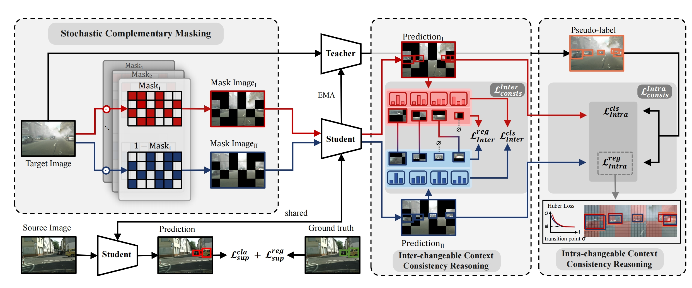

# Stochastic Context Consistency Reasoning for Domain Adaptive Object Detection

<p align="center">

</p>

# SOCCER
[ACM MM 24] Official Pytorch Code for **Stochastic Context Consistency Reasoning for Domain Adaptive Object Detection**

We will release the code after the paper is published 😊

# Abstract
Domain Adaptive Object Detection (DAOD) aims to improve the adaptation of the detector for the unlabeled target domain by the labeled source domain.
Recent advances leverage a self-training framework to enable a student model to learn the target domain knowledge using pseudo labels generated by a teacher model.
Despite great successes, such category-level consistency supervision suffers from poor quality of pseudo labels.
To mitigate the problem, we propose a stochastic context consistency reasoning (SOCCER) network with the self-training framework. 
Firstly, we introduce a stochastic complementary masking module (SCM) to generate complementary masked images thus preventing the network from over-relying on specific visual clues.
Secondly, we design an inter-changeable context consistency reasoning module (Inter-CCR), which constructs an inter-context consistency paradigm to capture the texture and contour details in the target domain by aligning the predictions of the student model for complementary masked images.
Meanwhile, we develop an intra-changeable context consistency reasoning module (Intra-CCR), which constructs an intra-context consistency paradigm to strengthen the utilization of context relations by utilizing pseudo labels to supervise the predictions of the student model.
Experimental results on three DAOD benchmarks demonstrate our method outperforms current state-of-the-art methods by a large margin. 

## Preparatory Work

### 1.Installation
Our method is implemented based on PyTorch platform
using [detectron](https://github.com/facebookresearch/Detectron) framework.

Please refer to [environment.yml](environment.yml) to create the environment.


For installation problems, please consult issues in [ maskrcnn-benchmark
](https://github.com/facebookresearch/maskrcnn-benchmark).


### 2.Datasets

#### Cityscapes -> Foggy Cityscapes
* Please download Cityscapes and Foggy Cityscapes dataset from the [link](https://www.cityscapes-dataset.com/downloads/). Concretely, the `leftImg8bit_trainvaltest.zip` and `leftImg8bit_trainvaltest_foggy.zip` are used for Cityscapes and Foggy Cityscapes, respectively.
* The annotations should be processed with [cityscapes_2_coco.py](tools/cityscapes_2_coco.py) and [foggy_cityscapes_2_coco.py](tools/foggy_cityscapes_2_coco.py) to be converted into coco format.


#### Cityscapes -> BDD100K
* The subset of Cityscapes with seven shared categories is adopted as the source domain, and the annotation should be processed with  [cityscapes_7_classes_2_coco.py](tools/cityscapes_7_classes_2_coco.py) to be converted into coco format.
* For BDD100K, we download the dataset from [link](https://bdd-data.berkeley.edu/). We extract the daytime subset of BDD100K as the target domain, and converted into coco format by [bdd100k_2_coco.py](tools/bdd100k_2_coco.py).


#### Sim10K -> Cityscapes
* Download [Sim10k](https://fcav.engin.umich.edu/projects/driving-in-the-matrix) dataset. Particularly, we use `repro_10k_images.tgz` and `repro_10k_annotations.tgz` for Sim10k. The annotations should be processed with [sim10k_2_coco.py](tools/sim10k_2_coco.py) to be converted into coco format.
* Because the adaptation from Sim10K to Cityscapes are evaluated only on `car`, we change the `category_instancesonly` in [cityscapes_7_classes_2_coco.py](tools/cityscapes_7_classes_2_coco.py).


#### The datasets should be organized in the following structure.
```
datasets/
├── cityscapes
│   ├── annotations
│   └── leftImg8bit
├── foggy_cityscapes
│    ├── annotations
│    └── leftImg8bit_foggy
├── bdd100k
│    ├── bdd100k_labels_daytime_det_coco_val.json
│    ├── bdd100k_labels_daytime_det_coco_train.json
│    └── images
└── sim10k
     ├── JPEGImages
     └── car_instances.json
```
If you want to change the dataset loading path, please refer to this [file](maskrcnn_benchmark/config/paths_catalog.py).


## Training

For experiments in our paper, we use the following script to run Cityscapes to Foggy Cityscapes adaptation task:

```shell
python train_net.py 
```

## Testing

The trained model could be evaluated with the following script:
```shell
python test_net.py 
```

## Model Weights

we provide the model weights of SOCCER for Cityscapes→Foggy Cityscapes, which is used in the paper.

* [SOCCER for Cityscapes→Foggy Cityscapes](https://drive.google.com/file/d/1YE-bgx5IhhFF3u3MIvd5vS8zFSwARbci/view?usp=drive_link)

* [SOCCER for Cityscapes→BDD100K](https://drive.google.com/file/d/18rq8v4jwXSLJz-ZK61mN00vUATgl_DI8/view?usp=drive_link)

* [SOCCER for Sim10K→Cityscapes](https://drive.google.com/file/d/15ZmzZmJvzNezwIgR_YWItqO4SIg_52fI/view?usp=drive_link)

## Core Code Details of SOCCER

The most relevant files for SOCCER are:

* [configs/Faster_rcnn_R_50_FPN_SOCCER_C2F.yaml](configs/Faster_rcnn_R_50_FPN_SOCCER_C2F.yaml):
  All important experimental details are configured in this file.
* [tools/train_net.py](tools/train_net.py):
  Training script for SOCCER.
* [maskrcnn_benchmark/engine/trainer.py](maskrcnn_benchmark/engine/trainer.py):
  Training process for SOCCER.
* [maskrcnn_benchmark/modeling/stochastic_complementary_masking.py](maskrcnn_benchmark/modeling/stochastic_complementary_masking.py):
  Implementation of Stochastic Complementary Masking (SCM).
* [SOCCER.py](SOCCER.py): Specific loss functions as well as some experiments, visualization tools.


## Acknowledgements

SOCCER is based on the following open-source projects. 
We thank their authors for making the source code publicly available.

* [Masked Image Consistency](https://github.com/lhoyer/MIC)
* [sa-da-faster](https://github.com/yuhuayc/sa-da-faster)
* [maskrcnn-benchmark](https://github.com/facebookresearch/maskrcnn-benchmark)
